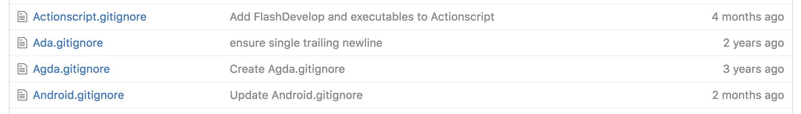

Whenever I start a project I always think to myself, "What the heck do I ignore?" Sometimes it's easy to discern. However, sometimes it's not.

For example, the past week or so I've been dabbling with Swift. I had no prior knowledge of Ios development and had no idea what should be exposed or not.

Here comes Github! They have a list of all sorts of `.gitignore` files for all types of projects.

Check out [https://github.com/github/gitignore][link] for the list.

Even if they aren't the most up-to-date (some files were last commited 2 years ago) it's still a nice base to have.

[link]: https://github.com/github/gitignore

