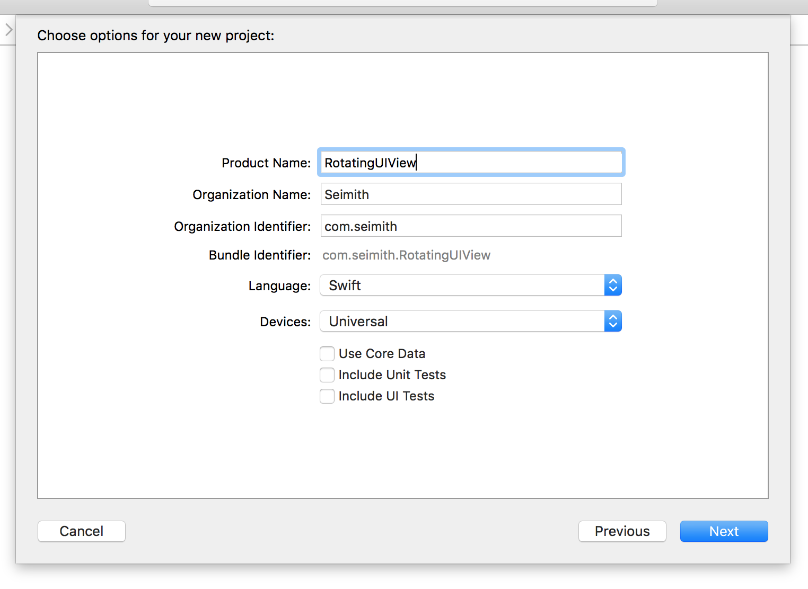
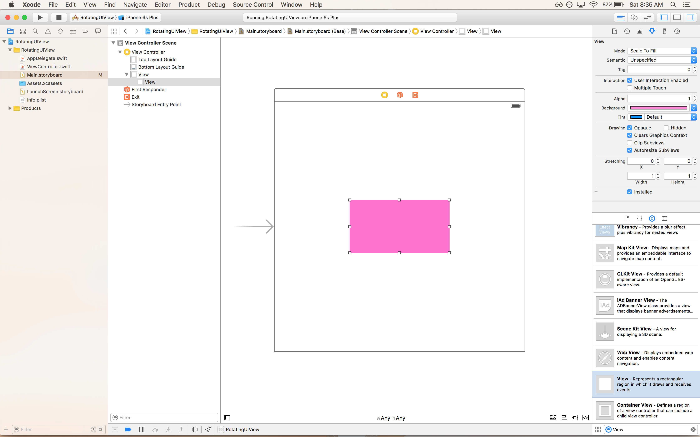
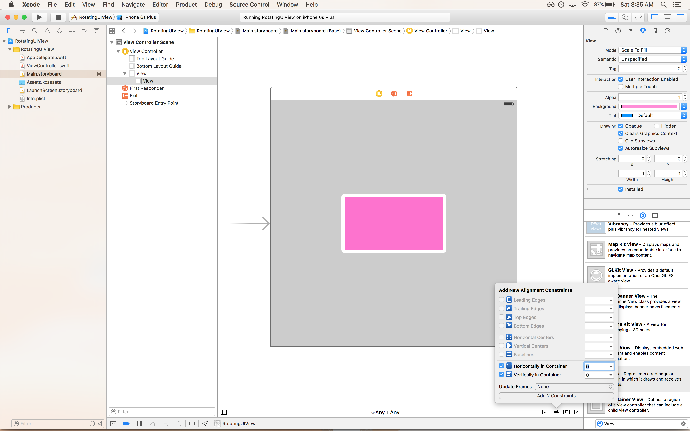
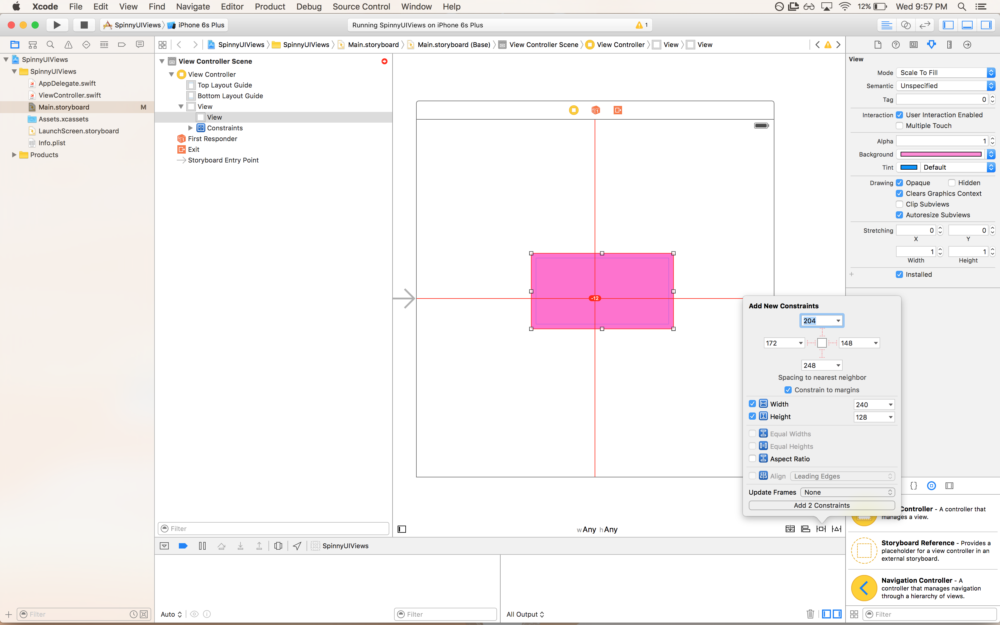
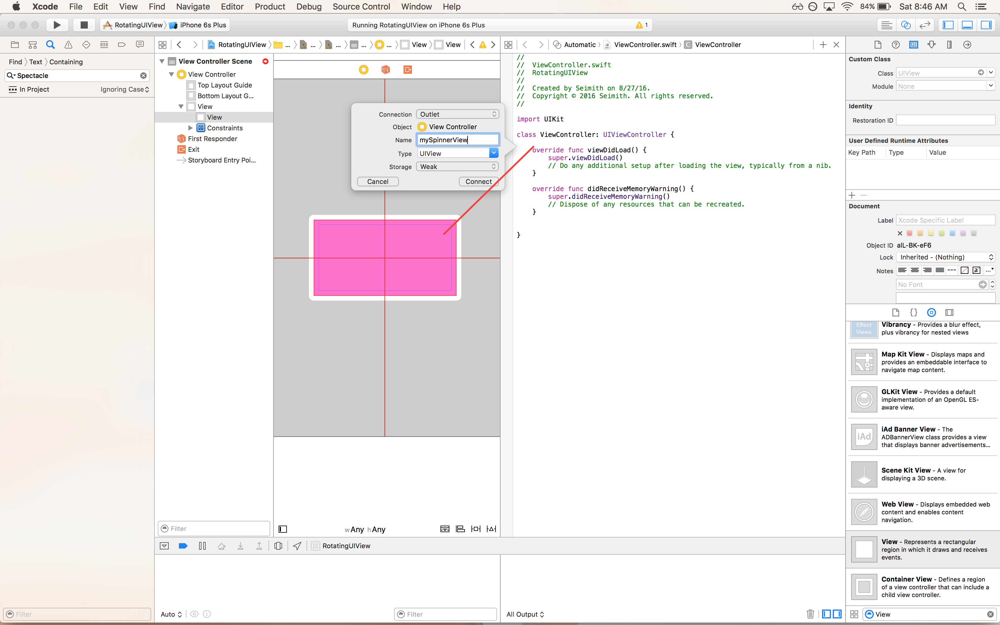
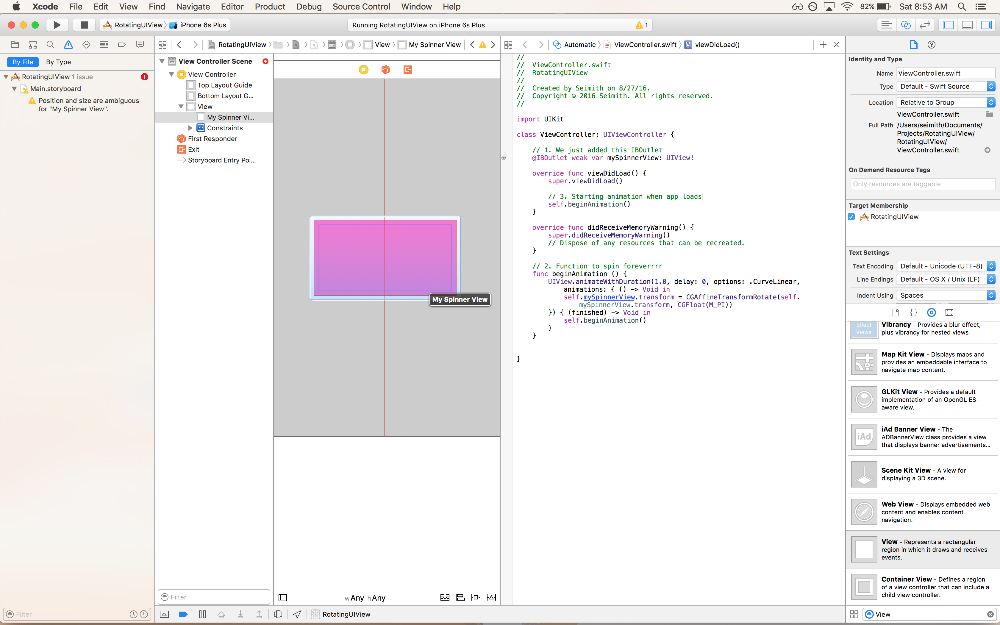

This tutorial is about spinning UIViews. Why spinning things you might ask? Animations can be (for a lack of better terminology because I hate this word) delightful for users.

Anywho, you might just need to animate a loading spinner thing or something for you app.

In this case, I've just created a few UIViews and added animation to it. If you want, you can even just use a UIImage component and spin that instead.


**Tools:**

- Swift 2.2
- Xcode Version 7.3.1

**Step 1: Create swift project**
Create a “Single View Application” project. If you don’t want extra folders in your project for testing, make sure you uncheck the items for tests.



**Step 2: Add `UIView` to storyboard**
Search up the UIView component in the bottom left corner of Xcode and drag it into your storyboard.

After adding the component to your storyboard, change it’s color so that you can see it. It will default to white which can be difficult to see.

If you run this in the simulator at this point, all sorts of misalignments will happen here. This is because there are no constraints.


**Step 3: Add constraints***
The first set of constraints that we’ll add here are “horizontal” and “vertical” constraints.

To do this make sure you have your UIView selected and then locate the icon at the bottom left of Xcode (look for the icon that look like sideways bar graphs). Then, check off the corresponding checkboxes.



The second set of constraints will be to give it a “width” and “height” constraint. To do this you need to find the square “Tie-fighter” icon at the bottom left of Xcode.



Once you add these two sets of constraints you’ll get a warning in the “Document Outline Panel”. Resolve these warnings as it will fix the placement of your UIView in your storyboard.


At this point if you run this in the simulator you’ll see that the UIView is centered in the middle of the screen in all rotations.


**Step 4: Create and connect IBOutlets to your controller**
Now that you have your UIView set up, it’s time to create an “IBOutlet”. This is kind of like a variable that exists in the “Interface Builder” and gets connected to your code.

There are multiple ways of creating an “IBOutlet”. These are the two ways that I create them.

***Version 1*** You want to add an `@IBOutlet` in your view controller.

```
- Open `ViewController.swift` file
- Add “@IBOutlet weak var mySpinnerView: UIView!” to the class
- Go to the storyboard to connect UIView w/ IBOUTLET
```

Your code should look something like this:

```swift{numberLines: true}
import UIKit

class ViewController: UIViewController {

  @IBOutlet weak var mySpinnerView: UIView!

  override func viewDidLoad() {
    super.viewDidLoad()
    // Do any additional setup after loading the view, typically from a nib.
  }

  override func didReceiveMemoryWarning() {
    super.didReceiveMemoryWarning()
    // Dispose of any resources that can be recreated.
  }
}
```

You should also notice that there is a tiny unfilled dot next to your `IBOutlet`. This means that this outlet is not connected to anything in your storyboard.

To connect your newly created `IBOutlet` go back to your storyboard and then click on your view controller. Make sure you have your `Utilities` panel (right panel icon) open. Here, you will see that there is a list of outlets with unfilled dots as well. This is where you can click + drag to connect them. The dot should now be filled in.


***Version 2*** Open your storyboard and click on `Show Assistant Editor` (this is the venn-diagram-looking icon in the top of Xcode).

```
Ctrl + Click drag the UIView into your class and then name it. The dot should not be filled in.
```





**Step 5: Add code to rotate forever**
In this example, we’re adding animation to spin a `UIView` once the app loads. To do that, we’ll create a function, then call that function within the `viewDidLoad` lifecycle function.

This is the function that contains the animation.

```swift{numberLines: true}
func beginAnimation () {
  UIView.animateWithDuration(1.0, delay: 0, options: .CurveLinear, animations: { () -> Void in
    self.mySpinnerView.transform = CGAffineTransformRotate(self.mySpinnerView.transform, CGFloat(M_PI))
  }) { (finished) -> Void in
    self.beginAnimation()
  }
}
```

Add code in your `viewDidLoad` to start the spinning

```
self.beginAnimation()
```

Your file should look like this:

```swift{numberLines: true}
import UIKit

class ViewController: UIViewController {

  // 1. We just added this IBOutlet
  @IBOutlet weak var mySpinnerView: UIView!

  override func viewDidLoad() {
    super.viewDidLoad()

    // 3. Starting animation when app loads
    self.beginAnimation()
  }

  override func didReceiveMemoryWarning() {
    super.didReceiveMemoryWarning()
    // Dispose of any resources that can be recreated.
  }

  // 2. Function to spin foreverrrr
  func beginAnimation () {
    UIView.animateWithDuration(1.0, delay: 0, options: .CurveLinear, animations: { () -> Void in
      self.mySpinnerView.transform = CGAffineTransformRotate(self.mySpinnerView.transform, CGFloat(M_PI))
    }) { (finished) -> Void in
      self.beginAnimation()
    }
  }
}
```

And that should be it. When you reload your simulator you should see a rotating pink square. Play around and add more spinning things!

**You can get the storyboard project is in [this repo][link].**

[link]: https://github.com/seimith/SwiftRotatingUIView
