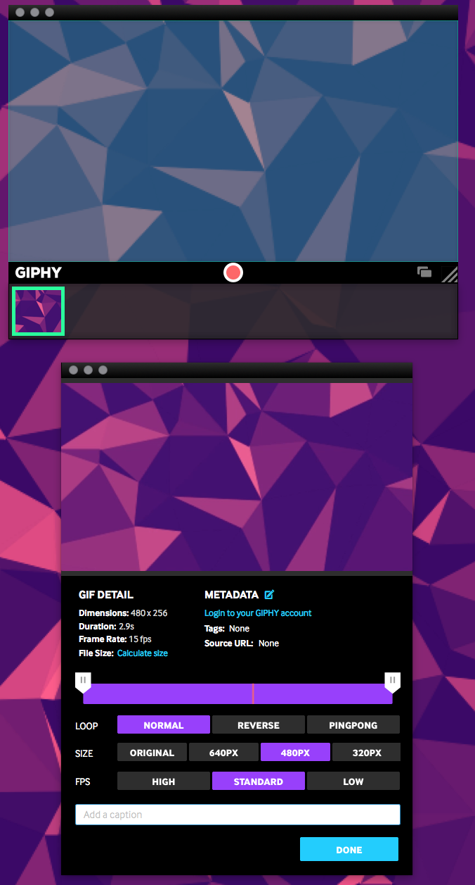

I wanted to give a shoutout to a cool app that I recently downloaded from the app store. It's called GIPHY and I use it to create gifs of what I'm doing.

It has a super simple user interface and thus is very intuitive to use.

There is an editing feature and it is super simple! It has options to cut the beginning and end of your gif, how to loop it, what size you want your gif to be, and how many frames per second you want your gif to be.

I totally recommend it! [Get GIPHY on iTunes!](https://itunes.apple.com/us/app/giphy-capture.-the-gif-maker/id668208984?mt=12 "GIPHY")

