This tutorial will demonstrate how to add a custom segue to your Swift app.

There are a few generic segues that are available to use in Xcode, however, you might be in a situation where you need specific transitions that might be better suited for gestures.

In this case, the animation in play will be a sliding one (great for swiping).


**Tools:**

- Swift 3.0
- Xcode Version 8.1

**Step 1: Create swift project**
Create a “Single View Application” project. If you don’t want extra folders in your project for testing, make sure you uncheck the items for tests.

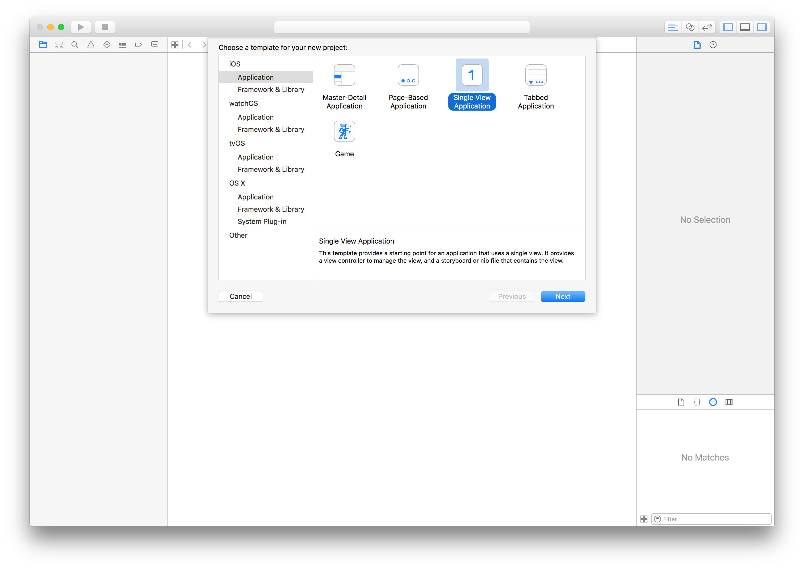

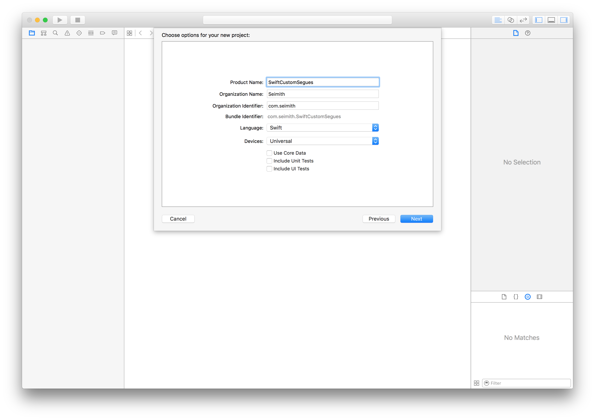

**Step 2: Create your segue**
I made a bit of a mistake here in naming my class with lowercase, "firstCustomSegue". However, this example works just find.

Make sure to select `UIStoryboardSegue` as the subclass and Swift as the language.

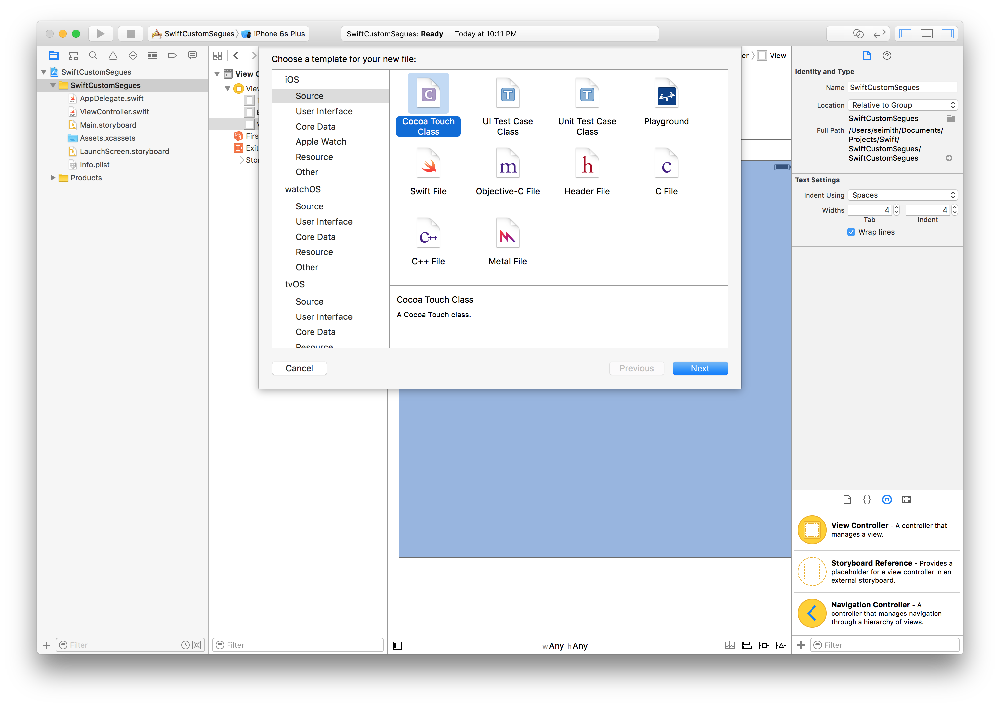

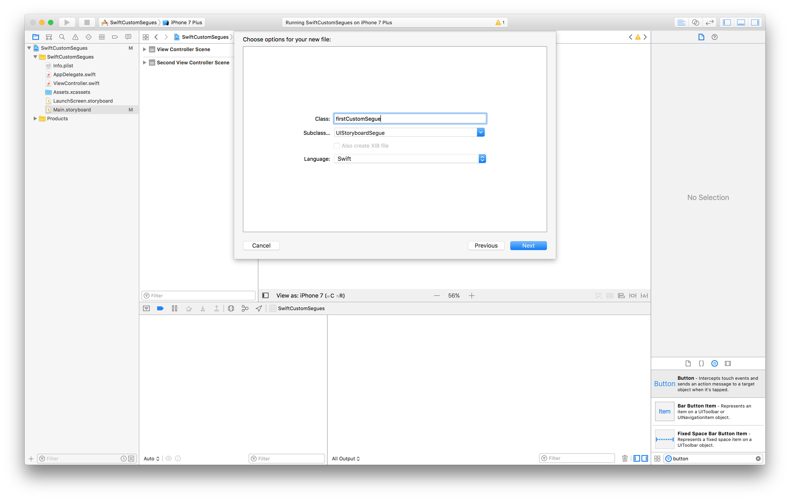

The following is the code + comments for the custom segue explaining each section.

```swift{numberLines: true}
import UIKit

class firstCustomSegue: UIStoryboardSegue {
    override func perform() {
        // Declare the INITAL view and the DESTINATION view
        // This will break and be nil if you don't have a second view controller for your DESTINATION view
        let initalView = self.source.view as UIView!
        let destinationView = self.destination.view as UIView!

        // Specify the screen HEIGHT and WIDTH
        let screenHeight = UIScreen.main.bounds.size.height
        let screenWidth = UIScreen.main.bounds.size.width

        // Specify the INITIAL PLACEMENT of the DESTINATION view
        initalView?.frame = CGRect(x: 0, y: 0, width: screenWidth, height: screenHeight)
        destinationView?.frame = CGRect(x: screenWidth, y: 0, width: screenWidth, height: screenHeight)

        // Access the app's key window and add the DESTINATION view ABOVE the INITAL view
        let appWindow = UIApplication.shared.keyWindow
        appWindow?.insertSubview(destinationView!, aboveSubview: initalView!)

        // Animate the segue's transition
        UIView.animate(withDuration: 0.4, animations: {
            // Left/Right
            initalView?.frame = (initalView?.frame.offsetBy(dx: -screenWidth, dy: 0))!
            destinationView?.frame = (destinationView?.frame.offsetBy(dx: -screenWidth, dy: 0))!
        }) { (Bool) in
            self.source.present(self.destination, animated: false, completion: nil)
        }
    }
}

```
**Step 3: Create a second view controller**
When you initially create your Swift app, you get a boilerplate set of files. One of them is the `ViewController.swift`. We're going to use this view controller, but in addition to this view controller we need to create another view controller for another view that we also need to make. `:-} in next step`

In this case, the new view controller that I've created here is called `SecondViewController`.

Make sure to update the subclass to `UIViewController`.

You don't need to add anything in the second view controller.

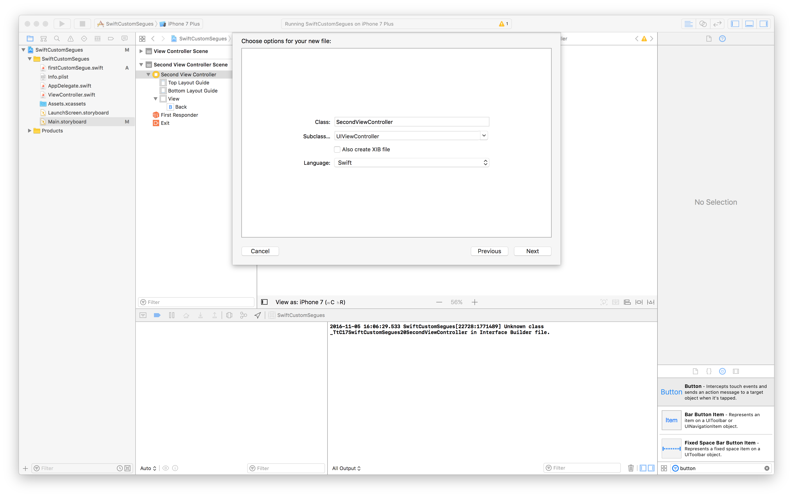

**Step 4: Add a second UIView controller to the storyboard**
Now that I've created a second view controller I need to add a new view controller.

This can be done via the `Main.storyboard` and by searching for `View Controller` and dragging it onto the board.

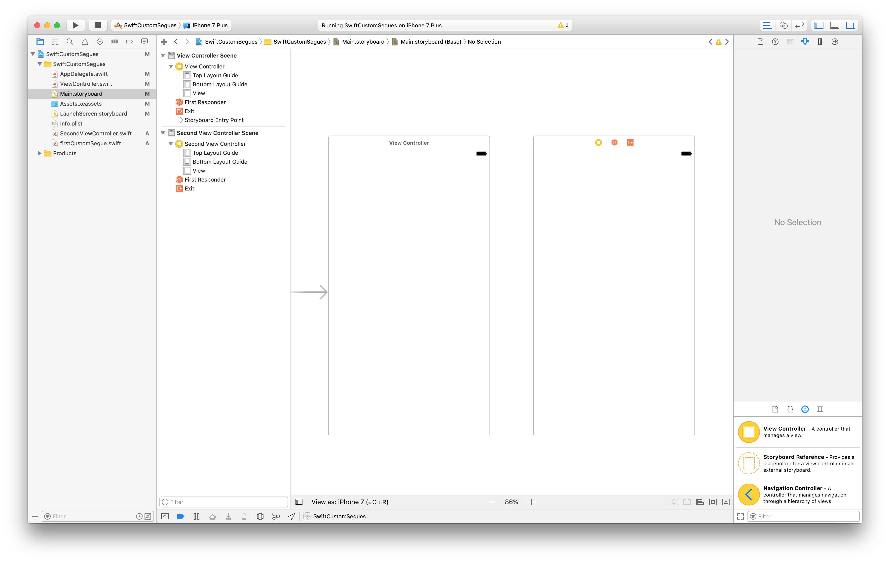

Once you do that you need to reassign the view controller "controlling" that new view.

Make sure you update the class to the `SecondViewController`.

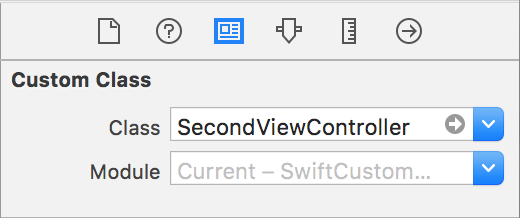

**Step 5: Differentiating the scenes, adding a button and its constraints**
Here, I've added different background colors to my views so I can visually differentiate the two scenes that I want to segue between.

I've also added a button such that I can use it to trigger my custom segue. You can totally add gesture recognizers here, but that's for another time. `:)`

In terms of constraints, I've added a total of 4 constraints to my button:

- Height
- Width
- Horizontally in Container
- Vertically in Container

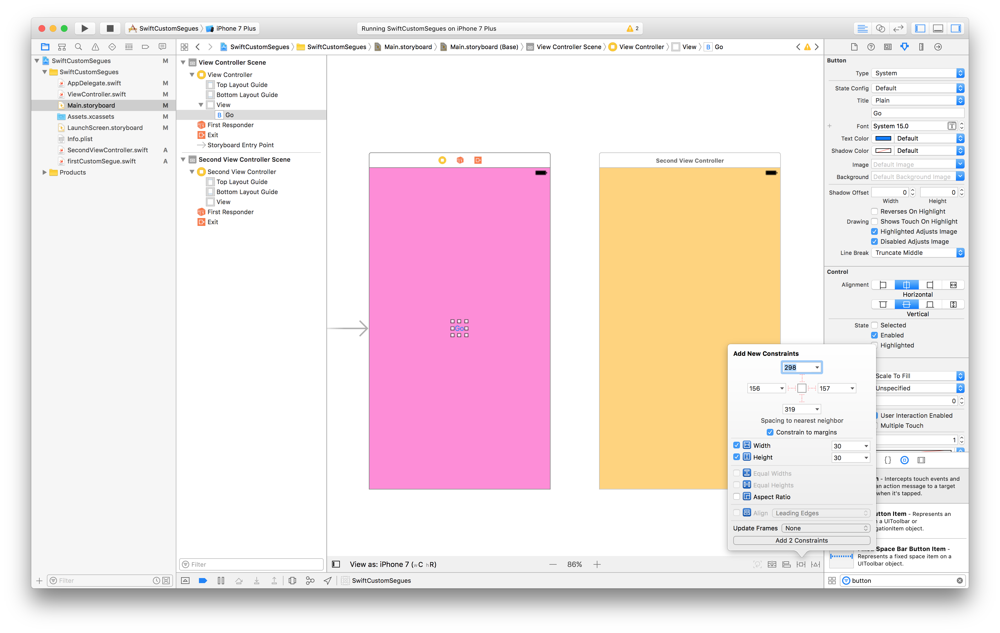

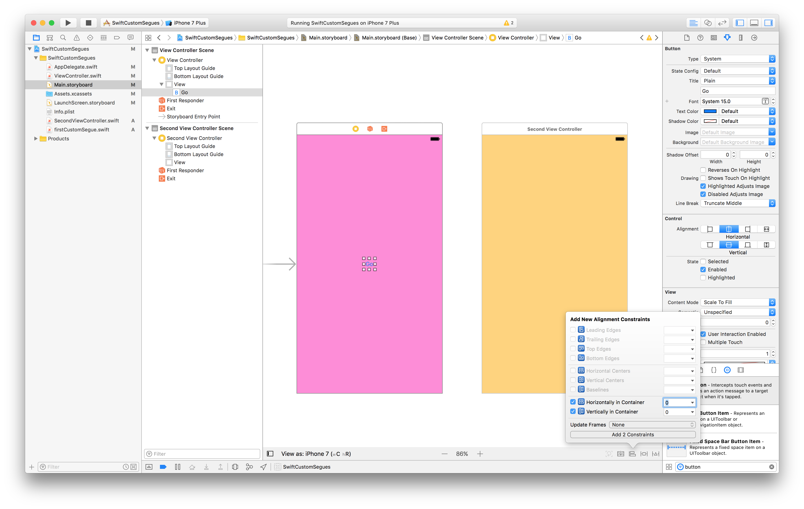

**Step 6: Setting the custom segue**
This is where you finally add the segue.

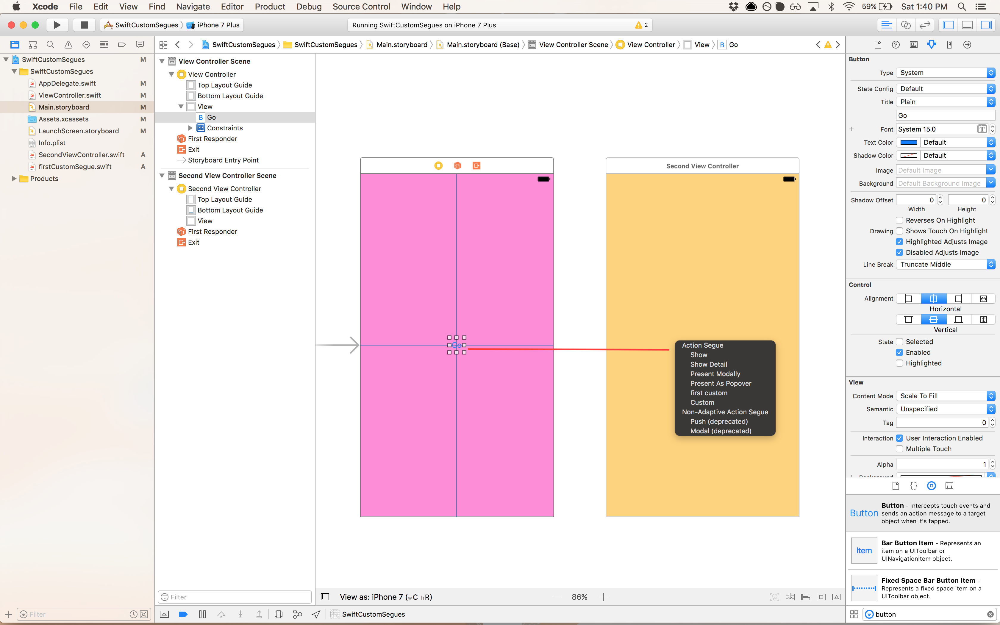

On a Mac, `control + click + drag`, from the button to the second view controller and you will get `Action Segue` selections.

Select `Custom`. (Although I see my custom segue class name in the list, `first custom`, selecting this has not worked for me.)

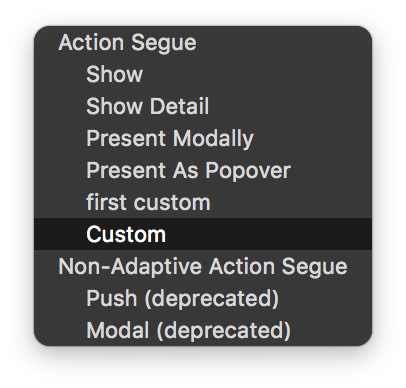

Now, click on the segue representation on the storyboard (the thing with the bracket icon connecting the two view controllers) and remember to update the following:

- Identifier
- Class
- Kind (should already be `Custom`)


And that should be it. When you load your simulator you should be able to segue by "sliding" between two scenes!

**You can get the storyboard project is in [this repo][link].**

[link]: https://github.com/seimith/SwiftCustomSegues
