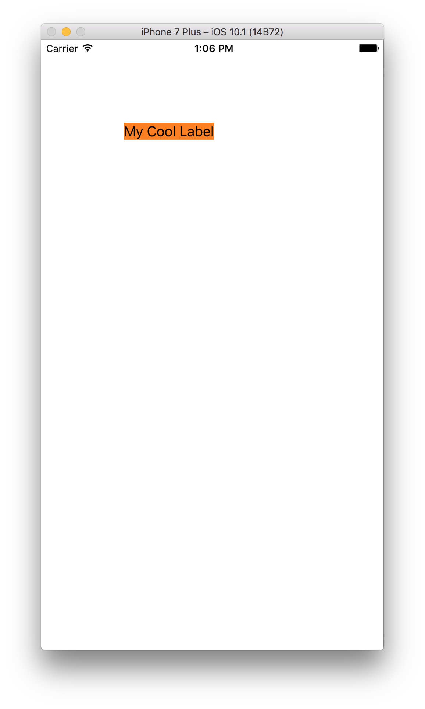
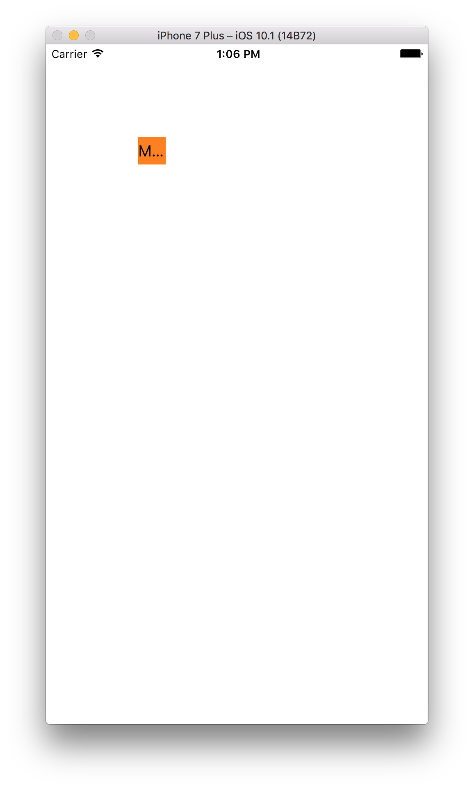

Here's a snippet of how you can make your UILabel conform to the width of your text.



You want to use `.sizeToFit()` on your UILabel, otherwise you'd have to hardcode  your label's width in the `CGRect`.

```swift{numberLines: true}
import UIKit

class ViewController: UIViewController {
  override func viewDidLoad() {
    super.viewDidLoad()

    let myCoolUILabel = UILabel()
    myCoolUILabel.text = "My Cool Label"
    myCoolUILabel.backgroundColor = UIColor.orange
    myCoolUILabel.frame = CGRect(x: 100, y: 100, width: 30, height: 30)
    myCoolUILabel.sizeToFit()
    self.view.addSubview(myCoolUILabel)
  }
}
```
So, no more of this:


