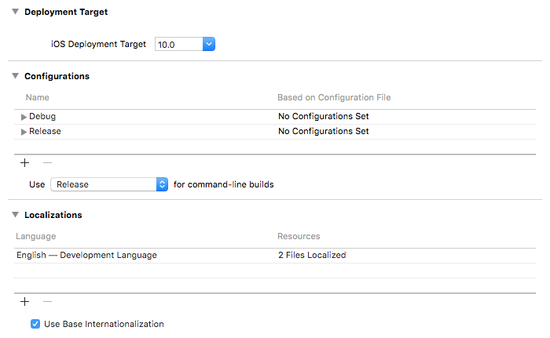
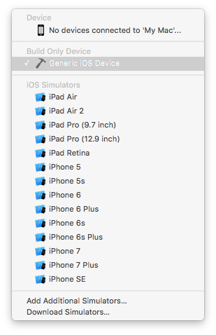

Have you ever ran into the issue of all of your simulators disappearing?

I have. My buddy created a new project and when I cloned her repo, all of my simulators cleared out!

Turned out that I needed to change my `iOS Deployment Target`. My buddy was running her project on `iOS10.1` and I had not updated and was still on 10.0.

Once I changed my target and performed a good clean, all my simulators returned!

